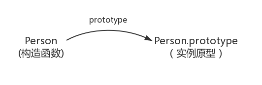
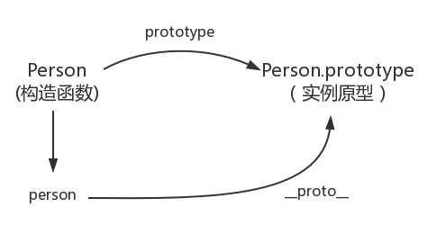
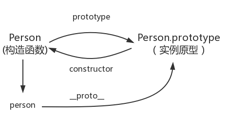
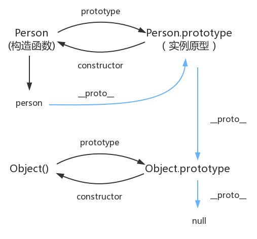

## 1. JS基础部分

### 1.1 从原型到原型链
```js
function Person() {

}
var person = new Person();
person.name = 'Totora6';
console.log(person.name) //Totora6
```
其中`Person`是一个构造函数，使用`new`创建了一个实例对象`person`。
#### prototype
```js
function Person() {

}
//每个函数都有一个prototype属性，并且该属性是函数才有的属性。
Person.prototype.name = 'Totora6';
var person1 = new Person();
var person2 = new Person();
console.log(person1.name); //Totora6
console.log(person2.name); //Totora6
```
函数的prototype指向了一个`对象`(调用该构造函数而创建的实例的`原型`【每一个JavaScript对象在创建的时候就会与之关联另一个对象，这个对象就是原型，每个对象都会从原型“继承”属性】)。
**继承**：继承意味着复制操作，但是在JavaScript中默认并不会复制对象的属性，而是在两个对象之间创建一个关联，这样一个对象就可以通过委托访问另一个对象的属性和函数，所以相对于说是继承，委托的方法应该更加恰当。


#### __proto__
`__proto__`是每一个JavScript对象都具有的一个属性，该属性会指向该对象的原型。
```js
function Person() {

}
var person = new Person();
console.log(person.__proto__ === Person.prototype);
```


#### constructor

该属性是由原型指向其关联的构造函数。
```js
function Person() {

}
console.log(Person === Person.prototype.constructor); //true
```



```js
function Person() {

}
var person = new Person();
console.log(person.__proto__ == Person.prototype); //true
console.log(Person.prototype.constructor == Person); //true
//ES5的方法获得一个对象的原型
console,log(Object.getPrototypeOf(person) === Person.prototype); //true
```
#### 实例与原型
```js
function Person() {

}
Person.prototype.name = 'Totora6';
var person = new Person();
person.name = 'Baymin';
console.log(person,name); //Baymin

delete person.name;
console.log(person.name);//Totora6
```
原型的原型
```js
var obj = new Object();
obj.name = 'Totora6';
console.log(obj.name); //Totora6
console.log(Object.prototype.__proto__ === null); //true
```


```js
function Person() {

}
var person = new Person();
console.log(person.constructor === Person); //true
//由于person中并没有constructor属性，所以会从person的原型中读取，而原型中存在该属性，所以返回true。
person,constructor === Person.prototype.constructor;
```
`__proto__`绝大部分浏览器会支持该非标准方法访问原型，但是它实际上并不存在于`Person.prototype`中，它实际上来自于`Object.prototype`，它更像是一个getter/setter，当使用`obj.__proto__`时，可以理解成返回了`Object.getPrototypeOf(obj)`。
### 1.2 作用域和动态作用域
`作用域`：js使用词法作用域，也就是静态作用域。
```js
var value = 1;
function foo() {
    console.log(value);
}

function bar() {
    var value = 2;
    foo();
}

bar(); 
```
`静态作用域`：执行foo()函数，从foo函数内部查找是否有局部变量value.如果没有就会根据书写的位置去查找上一层的代码，即value等于1。
`动态作用域`：执行foo函数，从foo函数内部查找是否有局部变量value，如果没有就从调用函数的作用域即bar函数中寻找value变量，结果是2。
#### 动态作用域
bash是动态作用域
```js
var value = 1;
function foo () {
    ech0 $value;
}
function bar () {
    local value = 2;
    foo;
}
bar;
```
思考：
```js
var scope = "global scope";
function checkscope(){
    var scope = "local scope";
    fucntion f() {
        return scope;
    }
    return f;
}
checkscope(); //global scope
//错误，应该是打印local scope
```
```js
var scope = "global scope";
function checkscope() {
    var scope = "local scope";
    function f() {
        return scope;
    }
    return f;
}
checkscope()(); //local scope
```
两段都打印local scope的原因：
JS采用的是词法作用域，函数的作用域给予函数创建的位置。
【JS函数的执行用到了作用域链，该作用域链是在函数定义的时候创建的，嵌套函数f()定义在这个作用域链里，其中的变量scope一定是局部变量，不管何时何地执行函数f()，这种绑定在执行f()时依然有效。】
### 1.3 执行上下文栈
