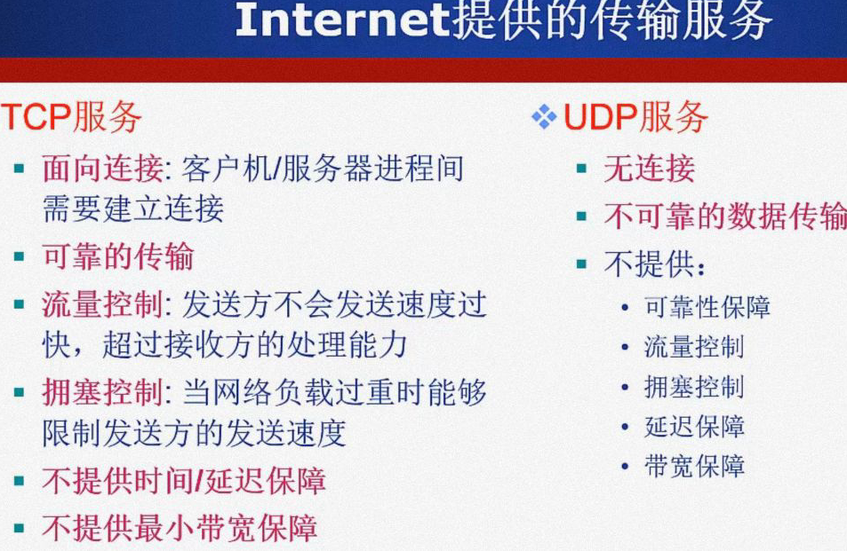

## 计算机网络

### 1. 计算机网络的概念

#### 1.1 什么是Internet?

- 定义：计算机网络就是`互连`的、`自治`的计算机集合。
- （组成细节：）全球最大的`互连网络`：`ISP(Internet Service Provider)`

  - 数以百万计的互连的计算机设备集合：`主机（host）=端系统（end system）`
  - 通信链路：光纤、铜缆、无线电、卫星......
  - 分组交换：`路由器`（routers）和`交换机`（switches）
- （服务：）为网络应用提供通信服务的通信基础设施、为网络应用提供应用编程接口（API）

#### 1.2 什么是网络协议？

- 硬件是计算机网络的基础，计算机网络中的数据交换必须遵守事先约定好的规则--`协议`。
- `网络协议(network protocol)`，简称协议：规定了通信实体之间所交换的消息的格式、意义、顺序以及针对收到信息或发生的事件所采取的“动作”。
- 协议三要素：`语法(Syntax)`、`语义(Semantics)`、`时序(Timing)`
- Internet协议标准：`RFC`：Request for Comments、`IETF`：互联网工程任务组

#### 1.3 计算机网络结构

- `网络边缘`：主机（端系统）、客户/服务器（client/server）应用模型、P2P应用模型
- `接入网络、物理介质`：数字用户线路(DSL)、电缆网络、无线接入网络
- `网络核心`：网络核心的关键功能是路由routing【确定分组从源到目的传输路径】和转发forwarding【将分组从路由器的输入端口交换至正确的输出端口】；

#### 1.4 网络核心

如何实现数据通过网络核心从源主机到达目的主机？**数据交换**

数据交换的类型：

- 电路交换：
  - 最典型电路交换网络是电话网络
  - 电路交换的三个阶段：建立连接、通信、释放连接
  - 特点：独占资源
  - 多路复用(multiplexing)：频分多路复用(FDM)、时分多路复用(TDM)、波分多路复用(WDM)、码分多路复用(CDM)`各用户码片序列相互正交`
- 报文交换
- 分组交换
- 
  - 分组交换的报文交付时间：

考研例题：

#### 1.5 计算机网络的性能

- 速率
- 带宽
- 延时/时延：
  - 分组交换为什么会发生丢包和时延？**分组在路由器缓存中排队**
  - 四种分组延迟： 

- 时延带宽积：

- 分组丢失（丢包）：

- 吞吐量/率

#### 1.6 计算机网络体系结构概述

- OSI参考模型：

- TCP/IP参考模型：

- 5层参考模型：

### 2. 应用层

网络应用与单机应用有哪些本质性的不同？

#### 2.1 网络应用的体系结构

- 客户机/服务器结构(Client-Sever, C/S)
- 点对点结构(Peer-to-peer, P2P)：优点`高度可伸缩`；缺点`难于管理`
- 混合结构(Hybrid)

#### 2.2 网络进程通信

- 网络应用的基础：进程间通信
- 进程：`主机上运行的程序`

- 同一主机上运行的进程之间如何进行通信？**进程间通信机制**、**操作系统提供**

##### 2.2.1 套接字：Socket

- 进程间通信利用socket发送/接收消息实现
- 如何寻址进程？
  1. 寻址主机：`IP地址`
  2. 端口号/Port number：为主机上每个需要通信的进程分配一个端口号
  3. 进程的标识符：`IP地址+端口号`

- 应用层协议

#### 2.3 网络应用需求

#### 2.4 WED应用概述

world wide web

HTTP协议概述：

1. 遵循超文本传输协议(Hyper Text Transfer Protocol)
2. 使用C/S结构
3. 使用TCP传输服务
4. 无状态(stateless)：服务器不维护任何有关客户端过去所发请求的信息

#### 2.5 HTTP

##### 2.5.1 HTTP连接

- `非持久性连接(Nonpersistent HTTP)`：每个TCP连接最多允许传输一个对象
- `持久性连接(Persistent HTTP)`：每个TCP连接允许传输多个对象

- 响应时间分析与建模：

